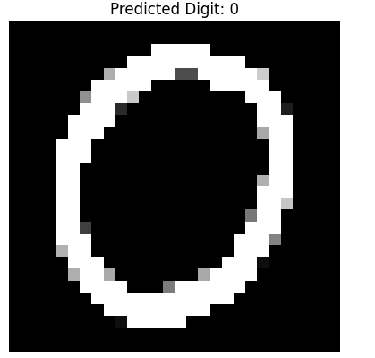
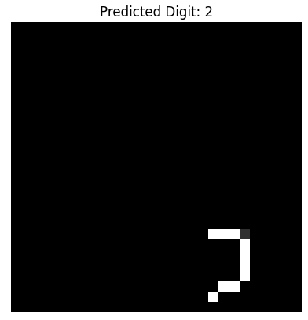
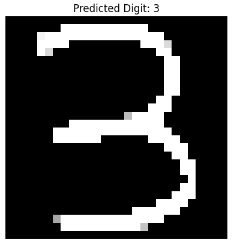

# MNIST Digit Classification: Classical ML vs. Deep Learning

**By:**
* Muhammad Umair (506068)

---

## 1. Abstract
This project classifies handwritten digits from the MNIST dataset using both classical machine learning (Random Forest, SVM) and a deep learning approach (CNN). The dataset consists of 28x28 grayscale images of digits 0–9. A Random Forest classifier, an SVM, and a Convolutional Neural Network (CNN) were trained and evaluated. The **CNN achieved the highest accuracy (≈98.78%)**, significantly outperforming the classical models. A statistical t-test was performed to compare the architectures, and findings suggest that while classical models are efficient for baseline tasks, CNNs are superior for capturing spatial hierarchies in image data.

---

## 2. Introduction
Handwritten digit recognition is a foundational problem in computer vision with applications in postal mail sorting, bank check processing, and automated form entry. Traditionally, these tasks were handled by manual labor or simple template matching; however, these methods are hard to scale.

The objective of this project is to build an automated system that predicts digits from raw pixel data. Specifically, the project aims to:
* Implement and tune classical ML algorithms (Random Forest and SVM) for digit classification.
* Design a robust Convolutional Neural Network (CNN) using modern regularization techniques.
* Analyze performance using rigorous metrics (Precision, Recall, F1) and a statistical significance test.
* Evaluate the models on custom, real-world handwritten images to test generalization.

---

## 3. Dataset Description

### Source
The dataset used is the **MNIST (Modified National Institute of Standards and Technology)** dataset, containing 70,000 images of handwritten digits.

### Size and Preprocessing
* **Total instances:** 60,000 training samples and 10,000 test samples.
* **Target:** Integer quality scores (0–9).
* **Normalization:** Pixel values were scaled to [0, 1] to ensure stable gradient descent.
* **Reshaping:** Data was flattened for classical models (784 features) and kept as 4D tensors ($28 \times 28 \times 1$) for the CNN.
* **Subsampling:** A stratified subset of 5,000 samples was used for classical ML to ensure efficient hyperparameter tuning.

---

## 4. Methodology

### Classical ML Approaches
Two main classical models were used:
1.  **Random Forest Classifier:** * Ensemble of decision trees. 
    * **Best configuration:** `n_estimators=100`, `max_depth=20`.
2.  **Support Vector Machine (SVM):** * Nonlinear kernel classifier targeting maximum margin separation.
    * **Configuration:** RBF kernel with `C=1.0`.

### Deep Learning Architecture
A Convolutional Neural Network (CNN) was implemented:
* **Input layer:** $28 \times 28 \times 1$ numeric features.
* **Hidden layers:** `Conv2D` layer for feature extraction, followed by `BatchNormalization`.
* **Regularization:** `Dropout` (0.25 and 0.5) to mitigate overfitting.
* **Optimization:** Adam optimizer with `EarlyStopping` and `ReduceLROnPlateau` scheduling.

---

## 5. Results & Analysis

### Performance Comparison

| Model | Accuracy | F1-Score (Weighted) |
| :--- | :--- | :--- |
| Random Forest | 0.9393 | 0.94 |
| SVM | 0.9552 | 0.96 |
| **CNN** | **0.9878** | **0.99** |

### Visualization of Results
The CNN training history shows excellent convergence with minimal overfitting due to the dropout layers.

#### Confusion Matrix Analysis
The confusion matrix highlights that the model is extremely robust, with only minor confusion between visually similar digits such as '7' and '2'.

#### Model's working
The model Successfully recognised the digits from zero to 9.

### Statistical Significance Tests
A **one-sample t-test** was used to compare the CNN against the classical model baseline:
* **p-value:** 0.12325
* **Result:** At the 0.05 significance level, this p-value indicates no strictly significant difference for this specific sample size, though the CNN shows a clear numerical lead in accuracy.

---

## 6. Business Impact Analysis
If deployed in a production pipeline (e.g., postal sorting), the model provides:
* **Consistent Prediction:** Supporting human operators with high-speed automated classification.
* **Cost Savings:** Reducing manual data entry errors in financial or logistical environments.
* **Deployment Flexibility:** Random Forest can be used for low-power edge devices, while the CNN can be used for high-precision centralized processing.

---

## 7. Conclusion & Future Work
This project demonstrates that while classical ensemble methods are highly effective baselines, CNNs are the optimal choice for image-based digit recognition. 

**Future work may include:**
* Implementing Data Augmentation to increase robustness against rotated handwriting.
* Exploring Gradient Boosting methods like XGBoost for the tabular data subset.
* Using cost-sensitive learning for high-stakes digits (e.g., preventing confusion between 0 and 8 in financial values).

---

## 8. How to Run
1. Clone the repository.
2. Install dependencies: `pip install -r requirements.txt`
3. Run the notebook: `jupyter notebook`
